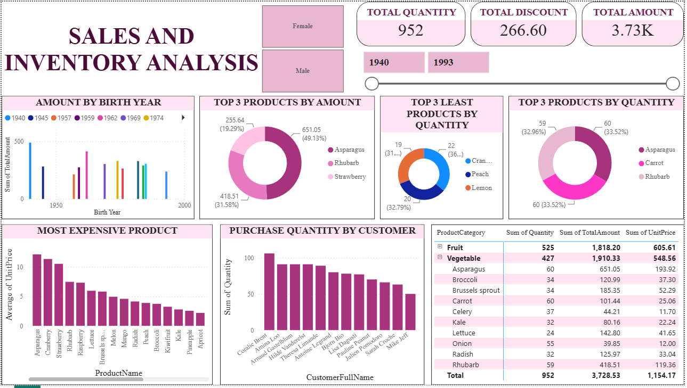

# Power BI Sales Dashboard

## Project Overview
This project showcases an interactive Power BI dashboard created to analyze sales data and generate meaningful business insights. The dashboard focuses on tracking key performance indicators, sales trends, and category-wise performance.

## Tools Used
- Microsoft Power BI
- Microsoft Excel
- Data Cleaning
- Data Visualization

## Dataset
The dataset contains sales information including product details, categories, sales values, and other business-related metrics. The data was cleaned and transformed before creating visualizations in Power BI.

## Dashboard Features
- Interactive KPI cards for important sales metrics
- Sales trend analysis
- Category-wise sales performance
- Regional performance analysis
- Interactive filters and slicers for better exploration

## Key Insights
- Analyzed overall sales performance using key metrics
- Identified top-performing categories and trends
- Compared sales performance across different segments
- Created an interactive dashboard for better decision-making

## Dashboard Preview

## Project Files
- Power BI Dashboard (.pbix) file
- Dataset (.xlsx) file
- Dashboard Screenshot (.png) file
